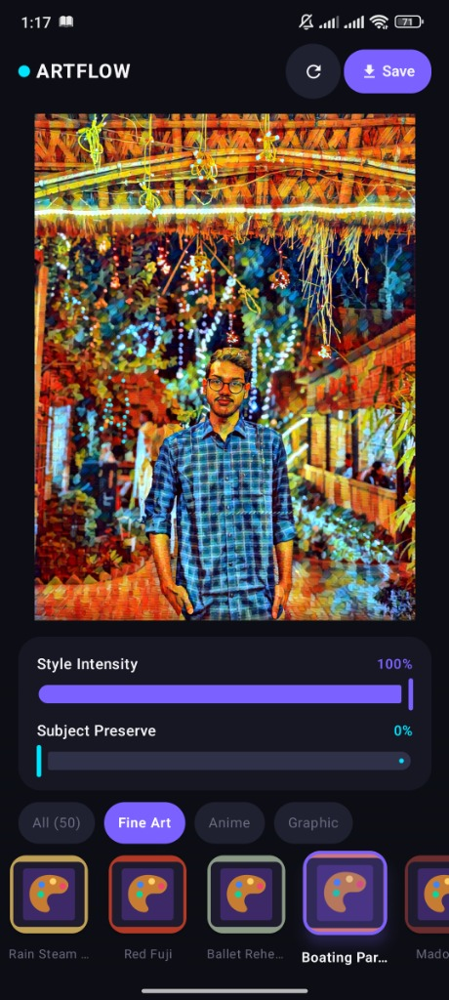
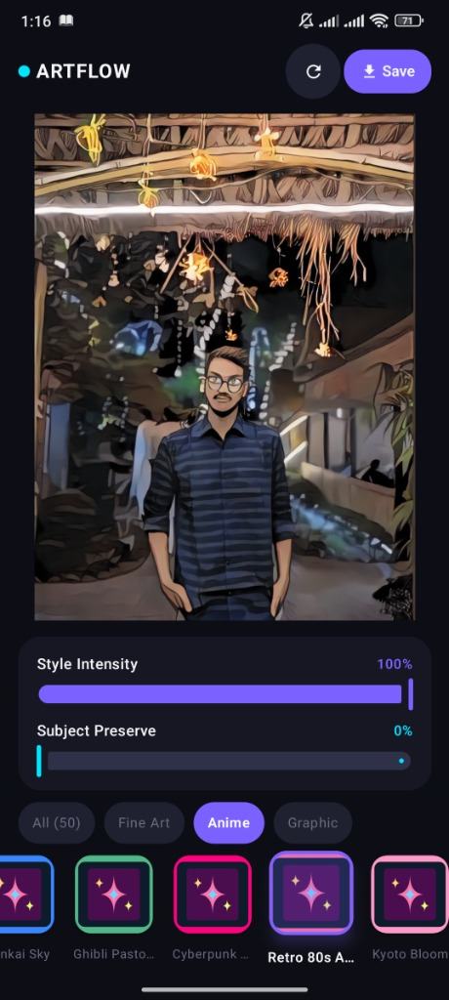
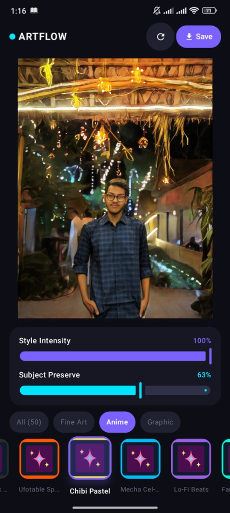
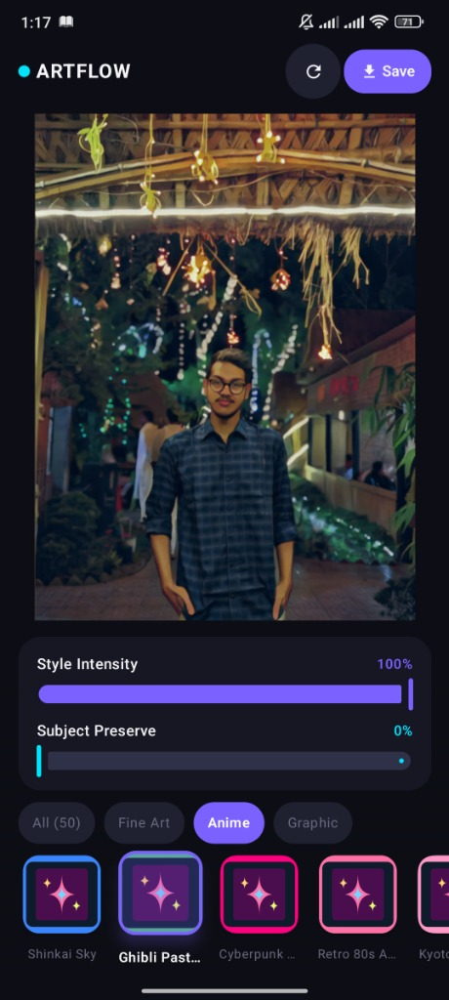
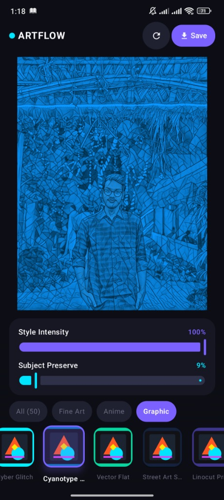
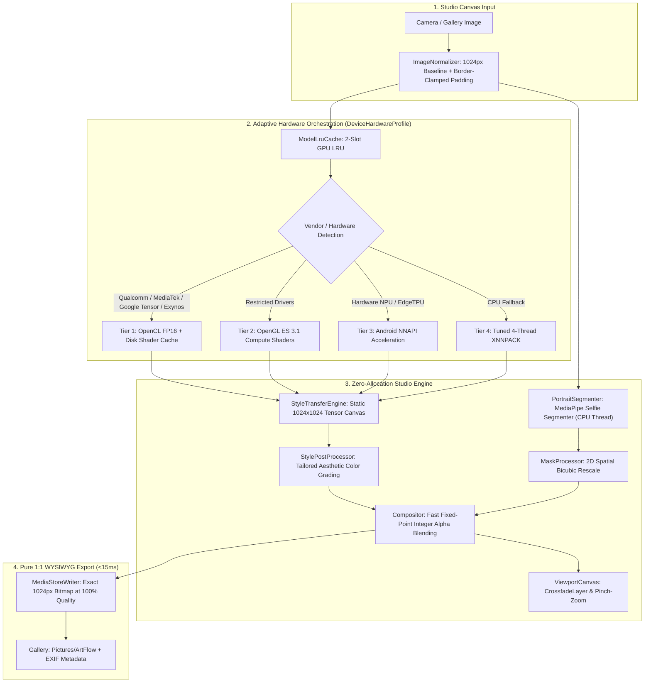

# ArtFlow — Offline On-Device Neural Art Studio

[-3DDC84.svg?style=flat&logo=android)](https://developer.android.com)
[](https://kotlinlang.org)
[](https://developer.android.com/jetpack/compose)
[-FF6F00.svg?style=flat&logo=tensorflow)](https://www.tensorflow.org/lite)
[](https://github.com/Sadik00789/Artflow-Android/releases/latest)
[](LICENSE)
[](#strict-offline--privacy-first)
[](#universal-hardware-acceleration--multi-vendor-support)

**ArtFlow** is a production-grade, 100% offline, on-device neural art studio for Android. It transforms ordinary photos into fine art paintings, anime drawings, and graphic illustrations using hardware-accelerated deep neural networks running directly on the device's GPU—with **zero cloud dependencies, zero telemetry, and zero network calls**.

👉 **[Download the Latest Standalone APK (v1.0.2)](https://github.com/Sadik00789/Artflow-Android/releases/download/v1.0.2/ArtFlow-v1.0.2.apk)**

---

## Studio Screenshots & Live Stylization

| Fine Art: Boating Party | Anime: Retro 80s | Subject Preserve (63%) | Anime: Ghibli Pastoral | Graphic: Cyanotype |
| :---: | :---: | :---: | :---: | :---: |
|  |  |  |  |  |
| **Fine Art Preset**<br><sub>Pierre-Auguste Renoir</sub> | **Anime Preset**<br><sub>Classic 80s Hand-Cel</sub> | **Subject Protection**<br><sub>63% Persona Isolation</sub> | **Anime Preset**<br><sub>Studio Ghibli Lush Tones</sub> | **Graphic Preset**<br><sub>Monochrome Blueprint</sub> |

---

## Key Highlights

- **50 Neural Art Styles**: Curated collection spanning **Fine Art** (18 styles), **Anime** (16 styles), and **Graphic Design** (16 styles).
- **Authentic Neural Palettes & Tailored Graphic Grading**: Pre-trained neural networks (AnimeGANv2 and TransformerNet) render with their authentic color balance and pristine skin tones, while Graphic print styles (Warhol posterization, Cyanotype, Manga screentone, Swiss typography) feature tailored fast fixed-point (`shr 8`) palette transformations.
- **Hero Neural Architectures**:
  - **Johnson et al. Fast-Neural-Style (`TransformerNet`)** with residual blocks and instance normalization.
  - **Official AnimeGANv2 (`AnimeGANGenerator`)** with inverted residual blocks, depthwise convolutions, and bilateral upsamplers.
- **1024px High-Fidelity Studio Canvas**: Standard 3:4 portrait photos render at $768\times 1024\text{px}$ ($4\times$ the resolution of standard $512\text{px}$ models), preserving crisp brushstroke textures, fine cel lines, and canvas grain.
- **Pure 1:1 WYSIWYG Export**: Directly exports the exact on-screen composite preview to `Pictures/ArtFlow` at 100% lossless JPEG quality in $<15\text{ms}$ with full EXIF metadata and zero alteration.
- **Selfie Segmentation & Subject Protection**: Real-time on-device portrait isolation running with edge-guarded subject preservation and tailored aesthetic color grading.
- **Universal Multi-Vendor Hardware Acceleration (`DeviceHardwareProfile`)**:
  - **Qualcomm Snapdragon (8 Elite, 8 Gen 1–3, 7/6 series)**: Native OpenCL FP16 with persistent Adreno disk shader binary caching (`codeCacheDir`), eliminating driver lockups and recompilation latency.
  - **Google Pixel Tensor Processors (G1–G5 / Pixel 6–9 Pro Fold)**: Native OpenCL acceleration enabled via `<uses-native-library>` manifest linker permissions and disk shader binary serialization (`clGetProgramInfo`), with automatic fallback to OpenGL ES 3.1 Compute, Android NNAPI (EdgeTPU), and multi-threaded CPU.
  - **MediaTek Dimensity & Helio (Dimensity 700–9400)**: Resilient OpenCL FP16 with ARM Mali / Immortalis disk shader caching and OpenGL compute fallback.
  - **Samsung Exynos (ARM Mali & AMD RDNA Xclipse 530/920/940)**: Multi-backend resilience across mobile GPU architectures with disk shader caching.
  - **Universal CPU Fallback (Unisoc & Generic)**: Dynamically tuned XNNPACK multi-threading sized to performance cores (4 threads for tri-cluster architectures), keeping UI threads fluid.
- **Zero-Allocation Pipeline**: Pre-allocated pinned native direct buffers and 8-bit fixed-point integer math (`shr 8`), completely eliminating Large Object Space (LOS) garbage collection pauses.
- **Modern Jetpack Compose UI**: Edge-to-edge Material 3 dark theme, 120Hz smooth scrolling carousel, interactive pinch-to-zoom/pan canvas with crossfade transitions, and balanced dual intensity/subject isolation sliders.

---

## Architectural Workflow



---

## Model Catalog

ArtFlow bundles **52 optimized neural network models** directly in the APK:

### 1. Fine Art Presets (18 Models)
Based on Johnson et al. Fast-Neural-Style `TransformerNet` architecture:
- `starry_night` — Vincent van Gogh
- `the_scream` — Edvard Munch
- `great_wave` — Hokusai
- `guernica` — Pablo Picasso
- `monet_water_lilies` — Claude Monet
- `kandinsky_composition` — Wassily Kandinsky
- `klimt_the_kiss` — Gustav Klimt
- `van_gogh_sunflowers` — Vincent van Gogh
- `cezanne_mont_sainte_victoire` — Paul Cézanne
- `turner_rain_steam_speed` — J.M.W. Turner
- `hokusai_red_fuji` — Hokusai
- `degas_ballet` — Edgar Degas
- `renoir_boating_party` — Pierre-Auguste Renoir
- `munch_madonna` — Edvard Munch
- `picasso_weeping_woman` — Pablo Picasso
- `matisse_dance` — Henri Matisse
- `gauguin_tahitian_women` — Paul Gauguin
- `seurat_la_grande_jatte` — Georges Seurat

### 2. Anime Presets (16 Models)
Based on Bryan D. Lee / TachibanaYoshino AnimeGANv2 `AnimeGANGenerator` architecture:
- `shinkai_sky` — Makoto Shinkai aesthetic
- `ghibli_pastoral` — Studio Ghibli lush greens and soft tones
- `cyberpunk_neo_tokyo` — High-contrast neon anime look
- `retro_80s_anime` — Hand-cel aesthetic of classic 80s OVA
- `kyoto_bloom` — Vibrant pastel floral tones
- `manga_ink_wash` — High-contrast screentone and ink wash
- `ufotable_digital` — Modern composited digital lighting
- `chibi_pastel` — Soft cartoon palette
- `mecha_cel_shade` — Crisp mechanical edges and metallic sheen
- `lofi_chill` — Muted nostalgic tones
- `fantasy_isekai` — Luminous fantasy scenery
- `shoujo_sparkle` — Romantic watercolor aesthetic
- `dark_fantasy_berserk` — Grim heavy shadows
- `vaporwave_sunset` — 80s anime synth palette
- `city_pop_1984` — Tokyo retro-pop styling
- `trigger_action` — Dynamic saturated action styling

### 3. Graphic & Vision Models (18 Models)
- **16 Graphic Styles**: `bauhaus_geometry`, `pop_art_warhol`, `risograph_print`, `synthwave_neon`, `comic_halftone`, `swiss_typographic`, `art_deco_gold`, `cyber_glitch`, `blueprint_cyanotype`, `vector_flat`, `stencil_street_art`, `linocut_print`, `psychedelic_60s`, `holographic_iridescent`, `charcoal_sketch`, `woodblock_ukiyoe`.
- **2 Vision Models**:
  - `vision/fsrcnn_x2_fp16.tflite` — Secondary vision model asset.
  - `vision/selfie_segmenter.tflite` — On-device portrait segmenter.

---

## Universal Hardware Acceleration & Multi-Vendor Support

ArtFlow contains a dedicated hardware abstraction layer ([DeviceHardwareProfile.kt](file:///home/sadik/Downloads/artflow-android/app/src/main/java/com/artflow/app/engine/hardware/DeviceHardwareProfile.kt)) engineered to maximize inference throughput across all Android processors:

| Vendor / SoC Family | GPU Architecture | Acceleration Strategy |
| :--- | :--- | :--- |
| **Qualcomm Snapdragon** (8 Elite, 8 Gen 1/2/3, 7/6 series) | Adreno 6xx / 7xx / 8xx | **Tier 1 (OpenCL FP16)** with persistent disk shader caching in `codeCacheDir`. |
| **Google Tensor** (Pixel 6, 7, 8, 9 Pro Fold - G1 to G5) | ARM Mali-G78 / G710 / G715 Immortalis | **Tier 1 (OpenCL FP16 + Disk Shader Cache)** via manifest `<uses-native-library>` $\to$ **Tier 2 (OpenGL ES 3.1 Compute)** $\to$ **Tier 3 (Android NNAPI / EdgeTPU)**. |
| **MediaTek Dimensity / Helio** (700–9400, Helio G99) | ARM Mali / Immortalis | **Tier 1 (OpenCL FP16 + Disk Cache)** $\to$ **Tier 2 (OpenGL ES 3.1)**; resilient fallback. |
| **Samsung Exynos** (1480, 2100, 2200, 2400) | ARM Mali & AMD RDNA Xclipse | **Tier 1 (OpenCL FP16 + Disk Cache)** $\to$ **Tier 2 (OpenGL ES 3.1)**; optimized for RDNA and Mali. |
| **Entry-Level / Generic** (Unisoc, etc.) | Generic / CPU | **Tier 3 (NNAPI)** $\to$ **Tier 4 (XNNPACK CPU)**; dynamically tuned thread pool protecting UI threads. |

---

## Pure 1:1 WYSIWYG Saving

Exporting an artwork bypasses secondary resizing and distortion pipelines:
- **Instant Save (<15ms)**: Grabs the exact on-screen composite bitmap and writes it directly to `MediaStore`.
- **100% Lossless JPEG Quality**: Preserves every brushstroke, fine cel line, and color gradient without compression artifacts.
- **EXIF Tagging**: Directly injects artist title, style preset name, and software metadata into local gallery storage.

---

## Project Structure

```text
artflow-android/
├── app/
│   ├── src/
│   │   ├── main/
│   │   │   ├── assets/models/             # 52 FP16 TFLite models (1024x1024 static)
│   │   │   │   ├── fine_art/              # 18 Fast-Neural-Style models
│   │   │   │   ├── anime/                 # 16 AnimeGANv2 models
│   │   │   │   ├── graphic/               # 16 Graphic models
│   │   │   │   └── vision/                # Vision & Selfie Segmenter models
│   │   │   ├── java/com/artflow/app/
│   │   │   │   ├── core/
│   │   │   │   │   ├── common/            # Result, DispatcherProvider
│   │   │   │   │   └── storage/           # AssetModelReader, MediaStoreWriter (1:1 WYSIWYG)
│   │   │   │   ├── engine/                # Inference Engine
│   │   │   │   │   ├── hardware/          # DeviceHardwareProfile (SoC / Vendor Detection)
│   │   │   │   │   ├── GpuDelegateProvider.kt   # 4-Tier Hardware Acceleration Delegate
│   │   │   │   │   ├── ModelLruCache.kt         # 2-Slot GPU LRU Cache
│   │   │   │   │   ├── DynamicTensorHandler.kt  # Zero-Allocation Direct Native Buffers
│   │   │   │   │   ├── StyleTransferEngine.kt   # Core 1024px Inference Engine
│   │   │   │   │   ├── processing/        # ImageNormalizer, Compositor, StylePostProcessor
│   │   │   │   │   └── segmentation/      # PortraitSegmenter, MaskProcessor
│   │   │   │   ├── model/                 # StyleCatalog (50 styles), Presets, EditorSettings
│   │   │   │   └── ui/                    # Jetpack Compose UI
│   │   │   │       ├── editor/            # ViewModel, Canvas, Carousel, Sliders
│   │   │   │       ├── theme/             # Material 3 Dark Palette
│   │   │   │       └── MainActivity.kt    # PhotoPicker, Permissions, Edge-to-Edge
│   │   │   └── AndroidManifest.xml
│   │   ├── test/                          # JVM Unit Tests (Robolectric/JUnit)
│   │   └── androidTest/                   # On-Device GPU Benchmarks
│   └── build.gradle.kts
├── tools/                                 # Offline Python ML Pipeline
│   ├── checkpoints/                       # Raw PyTorch .pth & .pt weights
│   ├── models/
│   │   ├── transformer_net.py             # Johnson et al. TransformerNet
│   │   └── animegan_generator.py          # Official AnimeGANv2 Generator
│   ├── converters/
│   │   └── builder.py                     # 1024px TF Modules & FP16 Exporters
│   ├── download_hero_checkpoints.py       # Automated Weight Downloader
│   ├── convert_all.py                     # 52-Model Batch Converter (1024x1024)
│   └── verify_tflite.py                   # Automated Numerical & NaN Verifier
├── gradle/libs.versions.toml              # Version Catalog
├── build.gradle.kts                       # Root Gradle Script
└── settings.gradle.kts
```

---

## Environment & Build Prerequisites

- **JDK**: Eclipse Temurin or OpenJDK 17 (`JAVA_HOME` pointing to JDK 17).
- **Android SDK**: Build-Tools `35.0.0` or `34.0.0`, Platform API `35`, Platform-Tools.
- **Gradle**: 8.10.2 (bundled wrapper `gradlew`).
- **Python (Optional for Model Toolchain)**: Python 3.10 or 3.11 with PyTorch 2.x and TensorFlow 2.x.

---

## Quick Start & Verification

### 1. Build the Android Debug APK
```bash
./gradlew assembleDebug
```
The resulting debug APK is output to:
```text
app/build/outputs/apk/debug/app-debug.apk
```

### 2. Run JVM Unit Tests
Execute the local unit test suite covering hardware detection, dimension normalization, and coroutine dispatching:
```bash
./gradlew testDebugUnitTest
```

### 3. (Optional) Re-run Python ML Model Conversion
If you want to re-download hero checkpoints and re-generate the 52 TFLite assets at 1024x1024:
```bash
# 1. Download official PyTorch and AnimeGANv2 checkpoints
python3 tools/download_hero_checkpoints.py

# 2. Batch convert all 52 models to FP16 TFLite
python3 tools/convert_all.py

# 3. Verify numerical bounds, shapes, and zero NaNs
python3 tools/verify_tflite.py
```

---

## Release Changelog

### v1.0.2 — Authentic Neural Palettes & Tailored Graphic Grading
- **Natural Neural Balance**: Restored authentic pre-trained color balance for Fine Art and Anime models, eliminating global RGB offsets to preserve natural skin tones, facial contours, and clean neutral whites.
- **Tailored Graphic Print Grading**: Dedicated fast fixed-point post-processing for Graphic styles requiring artificial palette re-mapping (Warhol 4-tone posterization, Cyanotype Prussian blue, Manga screentone S-curves, Swiss typography, and Synthwave/Glitch split-toning).
- **Zero-Allocation Hot Path**: Fast ITU-R BT.601 integer fixed-point math (`shr 8`) and in-place buffer mutation executing in sub-25ms.
- **Comprehensive Unit Testing**: Automated test coverage in `StylePostProcessorTest` validating that all 50 styles execute cleanly, neural styles pass through untouched, and graphic styles apply verified palette transformations.

### v1.0.1 — Universal Multi-SoC Acceleration & Studio Engine
- **Universal Hardware Optimization**: Native OpenCL FP16 acceleration with persistent disk shader compilation cache for Qualcomm Snapdragon (8 Elite, 8 Gen 1–3), Google Pixel Tensor (G1–G5), MediaTek Dimensity, and Samsung Exynos.
- **1024px Studio Canvas**: High-fidelity $768\times 1024\text{px}$ rendering pipeline with edge-to-edge Material 3 dark studio UI.
- **Apache 2.0 Open Source Licensing**: Clean open-source release with standalone APK distribution.

---

## Strict Offline & Privacy First

- **0 Remote APIs**: ArtFlow contains zero network client libraries and makes zero HTTP requests.
- **0 Telemetry / Analytics**: No tracking SDKs (no Firebase Analytics, no crash reporters, no tracking IDs).
- **Local Storage Only**: Photos selected via the system Photo Picker remain in app memory or are saved directly to local `MediaStore`.

---

## Attributions & Open-Source Credits

- **AnimeGANv2**: PyTorch port by [Bryan D. Lee](https://github.com/bryandlee/animegan2-pytorch) and original architecture by [TachibanaYoshino](https://github.com/TachibanaYoshino/AnimeGANv2).
- **Fast-Neural-Style**: Architecture and pretrained weights by [Justin Johnson et al.](https://github.com/pytorch/examples/tree/main/fast_neural_style).
- **FSRCNN**: Fast Super-Resolution Convolutional Neural Network by Dong et al.
- **MediaPipe**: Selfie Segmentation by Google.

---

## License

This project is licensed under the Apache License, Version 2.0 - see the [LICENSE](LICENSE) file for details. Model checkpoints are subject to their respective open-source licenses (MIT / Apache 2.0).
